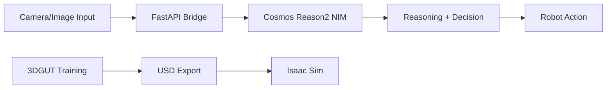

## What is NVIDIA Cosmos Cookoff?

NVIDIA Cosmos Cookoff is an intelligent robot navigation system that combines NVIDIA's Cosmos Reason2 Vision Language Model (VLM) with 3D Gaussian Splatting technology (3DGUT) to enable robots to navigate and understand their environment in real-time.

The project demonstrates how to build a complete vision-based decision-making pipeline for autonomous navigation, capable of detecting obstacles and making navigation decisions based on visual input.

## Architecture Overview

The system consists of three main components working together:

<CardGroup cols={3}>
  <Card title="Cosmos Reason2 VLM" icon="brain">
    NVIDIA's vision language model running as a NIM (NVIDIA Inference Microservice) container. Provides intelligent scene understanding and reasoning capabilities.
  </Card>
  
  <Card title="FastAPI Bridge" icon="server">
    A lightweight API bridge that handles image processing, temporary storage, and communication between clients and the Cosmos NIM.
  </Card>
  
  <Card title="3DGUT" icon="cube">
    3D Gaussian Splatting with Unscented Transforms for rendering real-world scenes and exporting to USD format for Isaac Sim integration.
  </Card>
</CardGroup>

### How It Works

1. **Image Acquisition**: Camera captures the robot's view
2. **Bridge Processing**: FastAPI bridge receives image (URL or base64) and instruction
3. **VLM Reasoning**: Cosmos Reason2 analyzes the scene and determines if the path is blocked
4. **Action Decision**: System converts reasoning into robot actions (move forward or stop)
5. **3D Reconstruction**: 3DGUT creates realistic 3D environments for simulation testing

## Key Features

<AccordionGroup>
  <Accordion title="Vision-Based Navigation">
    Uses Cosmos Reason2 VLM to understand camera images and detect obstacles in the robot's path. The model provides reasoning for its decisions, making the system interpretable.
  </Accordion>

  <Accordion title="Flexible Image Input">
    Supports both public image URLs and base64-encoded images with automatic temporary hosting for the NIM container.
  </Accordion>

  <Accordion title="Conservative Obstacle Detection">
    Implements a safety-first approach: any solid obstacle in the lower half of the image triggers a stop action to prevent collisions.
  </Accordion>

  <Accordion title="3D Scene Reconstruction">
    Train 3DGUT models on real-world scenes and export to USD format for testing in NVIDIA Isaac Sim.
  </Accordion>
</AccordionGroup>

## Use Cases

### Robot Vacuum Navigation
The primary use case is a robot vacuum with a front-facing camera. The system:
- Analyzes the forward view in real-time
- Detects obstacles like cones, barriers, boxes, walls, and furniture
- Makes conservative navigation decisions to avoid collisions
- Provides human-readable reasoning for each decision

### Isaac Sim Integration
Use 3DGUT to:
- Capture real-world environments with NeRF-style datasets
- Train Gaussian Splatting models for photorealistic rendering
- Export to USD format for NVIDIA Isaac Sim
- Test navigation algorithms in realistic virtual environments

### Custom Robot Applications
Adapt the system for:
- Delivery robots navigating indoor spaces
- Inspection robots in industrial settings
- Agricultural robots avoiding obstacles in fields
- Any wheeled robot requiring vision-based navigation

## Prerequisites

Before getting started, ensure you have:

<Steps>
  <Step title="NVIDIA GPU">
    A compatible NVIDIA GPU with sufficient VRAM:
    - **cosmos-reason2-2b**: Recommended for most users (lower memory requirements)
    - **cosmos-reason2-8b**: For higher accuracy (requires more VRAM)
  </Step>

  <Step title="Docker & NVIDIA Container Toolkit">
    - Docker installed and running
    - NVIDIA Container Toolkit for GPU access in containers
    - User added to the `docker` group (to run without sudo)
  </Step>

  <Step title="NGC Account & API Key">
    - NVIDIA NGC account (free signup at [ngc.nvidia.com](https://ngc.nvidia.com))
    - NGC API key for accessing NIM containers
  </Step>

  <Step title="Python Environment">
    - Python 3.8 or later
    - pip for installing dependencies
    - Virtual environment (recommended)
  </Step>
</Steps>

<Note>
  For 3D Gaussian Splatting features, you'll need additional setup including Conda and the 3DGRUT repository. See the 3DGUT training guide for details.
</Note>

## System Requirements

| Component | Minimum | Recommended |
|-----------|---------|-------------|
| GPU | NVIDIA GPU with 8GB VRAM | 16GB+ VRAM |
| RAM | 16GB | 32GB |
| Storage | 20GB free | 50GB+ free |
| OS | Ubuntu 20.04+ | Ubuntu 22.04 |

<Warning>
  The Cosmos Reason2 NIM container is several GB in size. Ensure you have sufficient disk space and a stable internet connection for the initial download.
</Warning>

## What's Next?

Ready to get started? Follow our [Quickstart Guide](/quickstart) to:
- Set up your NGC API key
- Pull and run the Cosmos Reason2 NIM container
- Launch the FastAPI bridge
- Make your first vision-based navigation request

<Card title="Quickstart Guide" icon="rocket" href="/quickstart">
  Get up and running in under 10 minutes
</Card>